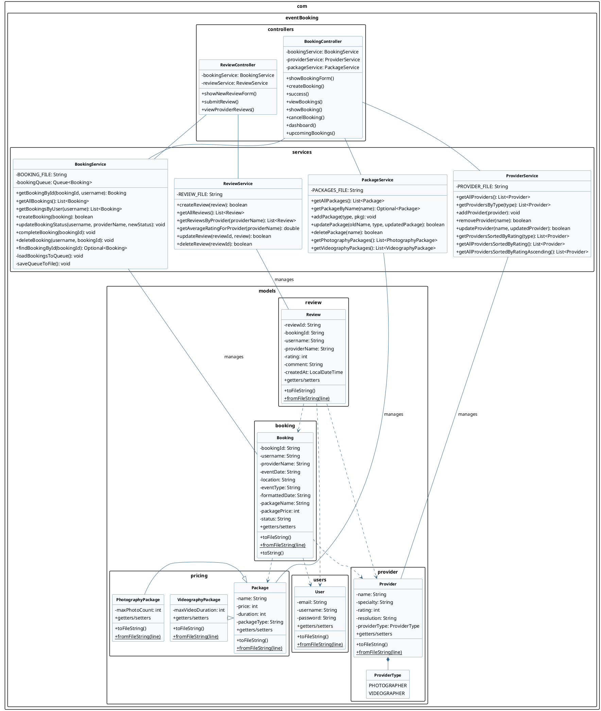

# Booking Management System - UML Class Diagram

## Booking Management System Architecture

1. **Models**:
   - **Booking**: Represents a booking made by a user for a provider's services. Contains details like booking ID, username, provider name, event date, location, event type, package details, and status.
   - **Review**: Represents a review left by a user for a provider after a booking is completed. Contains details like review ID, booking ID, username, provider name, rating, comment, and creation date.
   - **Package**: Represents a service package that can be booked. Contains details like name, price, and duration.
   - **Provider**: Represents a service provider (photographer or videographer) that can be booked.
   - **User**: Represents a user who can make bookings and leave reviews.

2. **Services**:
   - **BookingService**: Manages booking operations like creating, retrieving, updating, and deleting bookings.
   - **ReviewService**: Manages review operations like creating, retrieving, updating, and deleting reviews.
   - **PackageService**: Manages package operations like retrieving packages.
   - **ProviderService**: Manages provider operations like retrieving providers.

3. **Controllers**:
   - **BookingController**: Handles HTTP requests related to bookings, such as creating a booking, viewing bookings, and canceling bookings.
   - **ReviewController**: Handles HTTP requests related to reviews, such as creating a review and viewing reviews for a provider.

4. **Data Flow**:
   - Users create bookings for providers through the BookingController.
   - BookingController uses BookingService to manage bookings.
   - After a booking is completed, users can leave reviews through the ReviewController.
   - ReviewController uses ReviewService to manage reviews.
   - Both controllers use their respective services to interact with the model classes.

5. **File-based Persistence**:
   - All data is stored in text files rather than a database.
   - Each model class has toFileString() and fromFileString() methods for serialization/deserialization.

6. **Relationships**:
   - A Booking is associated with a User, Provider, and optionally a Package.
   - A Review is associated with a Booking, User, and Provider.
   - PhotographyPackage and VideographyPackage are specialized types of Package.
   - Provider has a ProviderType (PHOTOGRAPHER or VIDEOGRAPHER).
