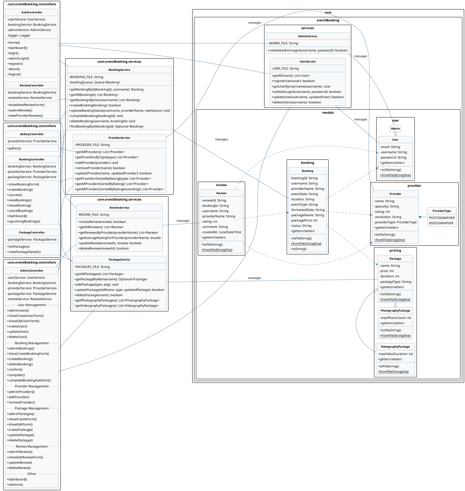

# Event Booking System - UML Class Diagram

## Design Patterns and Architectural Decisions

1. **MVC Architecture**:
   - Models: User, Admin, Provider, Booking, Review, Package, etc.
   - Views: Thymeleaf templates (not shown in diagram)
   - Controllers: BookingController, AdminController, AuthController, GalleryController, PackageController, ReviewController

2. **Service Layer Pattern**:
   - Services encapsulate business logic and data access
   - Controllers depend on services rather than directly accessing data

3. **File-based Persistence**:
   - All data is stored in text files rather than a database
   - Each model class has toFileString() and fromFileString() methods for serialization/deserialization

4. **Inheritance Hierarchy**:
   - Admin extends User
   - PhotographyPackage and VideographyPackage extend Package

5. **Enum Types**:
   - ProviderType enum for categorizing providers

6. **Spring Framework**:
   - Uses Spring MVC for web layer
   - Uses Spring's dependency injection for services
